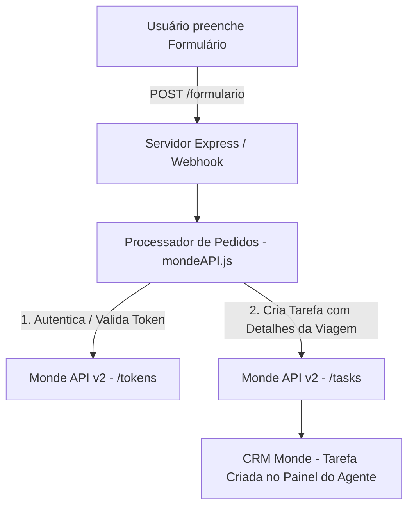

# ✈️ Sistema Monde - Integração Google Forms & Monde API

[](https://nodejs.org/)
[](https://expressjs.com/)
[](https://web.monde.com.br/api/v2)
[](https://developers.google.com/sheets/api)
[](LICENSE)

O **Sistema Monde** é uma solução de automação e integração backend desenvolvida em **Node.js** e **Express**. Ele captura solicitações de viagem recebidas através de formulários (Google Forms / Webhooks) e as transforma automaticamente em **tarefas organizadas no CRM Monde**, acelerando o atendimento e o fluxo de vendas de agências de turismo.

---

## 📌 Principais Funcionalidades

- **📥 Recepção de Webhooks**: Endpoint REST em Express para receber payloads dinâmicos de formulários.
- **🔄 Automação no Monde CRM**: Criação automática de tarefas categorizadas no Monde API v2 com dados completos da solicitação (origem, destino, datas, passageiros, bagagens, serviços adicionais, observações).
- **🔑 Autenticação Resiliente**: Gerenciamento de tokens Bearer da API Monde com mecanismo automático de reautenticação em caso de expiração do token (HTTP 401).
- **📊 Integração Google Sheets (Opcional)**: Módulo de leitura via Google Sheets API (v4) usando Service Account do Google Cloud.
- **🌐 Suporte a Exposição Remota**: Script para inicialização conjunta do servidor local com **ngrok** para recebimento de webhooks externos em ambiente de desenvolvimento.
- **🛠️ Scripts Utilitários**: Ferramentas CLI inclusas para consulta de IDs de usuários no Monde e teste de autenticação.

---

## 🏗️ Arquitetura e Fluxo de Dados



---

## 🛠️ Tecnologias Utilizadas

- **Runtime**: [Node.js](https://nodejs.org/)
- **Framework Web**: [Express 5](https://expressjs.com/)
- **Cliente HTTP**: [Axios](https://axios-http.com/)
- **Autenticação e Serviços Google**: [googleapis](https://github.com/googleapis/google-api-nodejs-client)
- **Gerenciamento de Ambiente**: [dotenv](https://github.com/motdotla/dotenv)
- **Túnel de Desenvolvimento**: [ngrok](https://ngrok.com/)

---

## 📂 Estrutura do Projeto

```text
Sistema_Monde/
├── postman/                        # Coleções do Postman para testes de API
│   └── collections/
│       └── New Collection/
├── scripts/                        # Scripts CLI utilitários
│   ├── buscarID.js                 # Lista usuários do Monde e seus respectivos IDs
│   └── token.js                    # Testa geração de token na API do Monde
├── src/
│   ├── services/
│   │   ├── googleforms.js          # Leitura de respostas via Google Sheets API
│   │   └── mondeAPI.js             # Integração principal com a API Monde v2
│   ├── utils/
│   │   └── estado.js               # Persistência local de estado do processador
│   └── server.js                   # Servidor Express principal
├── .env.example                    # Modelo de variáveis de ambiente
├── .gitignore                      # Regras de exclusão do Git
├── credentials.example.json        # Modelo de credenciais do Google Service Account
├── package.json                    # Dependências e scripts npm
├── start.bat                       # Script de inicialização automatizada no Windows
└── start.js                        # Ponto de entrada Node.js
```

---

## ⚙️ Pré-requisitos e Instalação

### Pré-requisitos
- [Node.js](https://nodejs.org/) (v16 ou superior)
- Gerenciador de pacotes `npm`
- Credenciais de acesso à API do [Monde CRM](https://web.monde.com.br/)

### Passos de Instalação

1. **Clonar o repositório:**
   ```bash
   git clone https://github.com/seu-usuario/Sistema_Monde.git
   cd Sistema_Monde
   ```

2. **Instalar as dependências:**
   ```bash
   npm install
   ```

3. **Configurar as Variáveis de Ambiente:**
   Copie o arquivo `.env.example` para `.env`:
   ```bash
   cp .env.example .env
   ```
   Edite o arquivo `.env` preenchendo suas credenciais:
   ```env
   # Credenciais Monde API
   MONDE_LOGIN=seu_email@suaagencia.com.br
   MONDE_PASSWORD=sua_senha
   MONDE_ASSIGNEE_ID=id_do_responsavel_no_monde

   # Google Sheets API (Se utilizado)
   SPREADSHEET_ID=id_da_sua_planilha
   GOOGLE_CREDENTIALS_PATH=credentials.json

   # Servidor Express
   PORT=3000
   ```

4. **Configurar Credenciais do Google (Opcional):**
   Caso utilize a integração com o Google Sheets, crie o arquivo `credentials.json` na raiz do projeto com base em `credentials.example.json`.

---

## 🚀 Como Executar

### 1. Inicialização Padrão (Node.js)
```bash
npm start
# ou
node start.js
```
O servidor estará rodando em `http://localhost:3000`.

### 2. Inicialização Automática com Ngrok (Windows)
Execute o arquivo `start.bat` para iniciar o servidor Node.js e abrir um túnel seguro via `ngrok` para receber webhooks externos em tempo real:
```cmd
start.bat
```

---

## 🛰️ Endpoints da API

### `POST /formulario`
Recebe o payload com as informações preenchidas no formulário e cria automaticamente uma nova tarefa no Monde CRM.

#### Exemplo de Payload (JSON):
```json
{
  "Cidade de destino": "Orlando - EUA",
  "nome": "João Silva",
  "Celular": "(11) 99999-8888",
  "E-mail": "joao.silva@email.com",
  "origem": "São Paulo (GRU)",
  "destino": "Orlando (MCO)",
  "ida": "2026-10-10",
  "volta": "2026-10-25",
  "flexibilidade": "Sim (+/- 3 dias)",
  "bagagem": "2 malas despachadas",
  "adultos": "2",
  "crianças": "1",
  "Serviços": ["Passagens Aéreas", "Hotel", "Ingressos Parques"],
  "transporte": ["Aluguel de Carro"],
  "Informações adicionais": "Preferência por hotel próximo aos parques da Disney."
}
```

#### Resposta de Sucesso (`200 OK`):
```json
{
  "status": "tarefa criada no Monde"
}
```

---

## 🛠️ Scripts Utilitários

- **Buscar IDs de usuários no Monde**:
  ```bash
  node scripts/buscarID.js
  ```
- **Testar geração de Token no Monde**:
  ```bash
  node scripts/token.js
  ```

---

## 📄 Licença

Este projeto está licenciado sob a licença [ISC](LICENSE).
